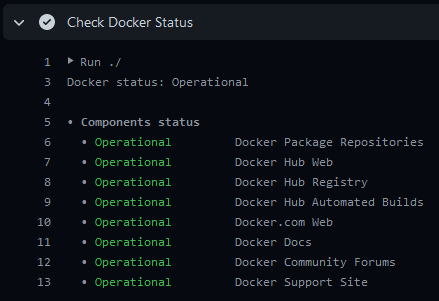

[](https://github.com/crazy-max/ghaction-docker-status/releases/latest)
[](https://github.com/marketplace/actions/docker-status)
[](https://github.com/crazy-max/ghaction-docker-status/actions?workflow=test)
[](https://codecov.io/gh/crazy-max/ghaction-docker-status)
[](https://github.com/sponsors/crazy-max)
[](https://www.paypal.me/crazyws)

## About

GitHub Action to check [Docker system status](https://status.docker.com/) in your workflow.

If you are interested, [check out](https://git.io/Je09Y) my other :octocat: GitHub Actions!

___

* [Features](#features)
* [Usage](#usage)
  * [Basic workflow](#basic-workflow)
  * [Trigger error if Docker services are down](#trigger-error-if-docker-services-are-down)
* [Customizing](#customizing)
  * [inputs](#inputs)
* [Keep up-to-date with GitHub Dependabot](#keep-up-to-date-with-github-dependabot)
* [How can I help?](#how-can-i-help)
* [License](#license)

## Features

* Threshold management for each Docker service or global (rollup)
* Display status of all services
* Display active incidents and updates

## Usage

### Basic workflow

The following workflow is purely informative and will only display the current status of Docker:



```yaml
name: build

on: push

jobs:
  build:
    runs-on: ubuntu-latest
    steps:
      -
        name: Check Docker Status
        uses: crazy-max/ghaction-docker-status@v1
```

### Trigger error if Docker services are down

In the example below we will set some status thresholds so that the job can fail if these thresholds are exceeded.

This can be useful if you have an action that publishes to Docker Hub registry but the service is down.

```yaml
name: build

on: push

jobs:
  build:
    runs-on: ubuntu-latest
    steps:
      -
        name: Checkout
        uses: actions/checkout@v2
      -
        name: Set up Docker Buildx
        uses: docker/setup-buildx-action@v1
      -
        name: Login to DockerHub
        uses: docker/login-action@v1
        with:
          username: ${{ secrets.DOCKERHUB_USERNAME }}
          password: ${{ secrets.DOCKERHUB_TOKEN }}
      -
        name: Check Docker Hub Status
        with:
          overall_threshold: degraded_performance
          hub_registry_threshold: service_disruption
      -
        name: Build and push
        uses: docker/build-push-action@v2
        with:
          context: .
          file: ./Dockerfile
          push: true
          tags: user/app:latest
```

## Customizing

### inputs

Following inputs can be used as `step.with` keys

| Name                               | Type    | Description                                                                           |
|------------------------------------|---------|---------------------------------------------------------------------------------------|
| `overall_threshold`                | String  | Defines threshold for overall status (also called rollup) of Docker to fail the job   |
| `package_repositories_threshold`   | String  | Defines threshold for Docker package repositories to fail the job                     |
| `hub_web_threshold`                | String  | Defines threshold for Docker Hub web to fail the job                                  |
| `hub_registry_threshold`           | String  | Defines threshold for Docker Hub registry to fail the job                             |
| `hub_automated_builds_threshold`   | String  | Defines threshold for Docker Hub automated builds to fail the job                     |
| `web_threshold`                    | String  | Defines threshold for Docker web to fail the job                                      |
| `docs_threshold`                   | String  | Defines threshold for Docker docs to fail the job                                     |
| `community_forums_threshold`       | String  | Defines threshold for Docker community forums to fail the job                         |
| `support_site_threshold`           | String  | Defines threshold for Docker support site to fail the job                             |

> Accepted values for threshold are `operational`, `degraded_performance`, `partial_service_disruption`,
> `service_disruption`, `security_event`.

## Keep up-to-date with GitHub Dependabot

Since [Dependabot](https://docs.github.com/en/github/administering-a-repository/keeping-your-actions-up-to-date-with-github-dependabot)
has [native GitHub Actions support](https://docs.github.com/en/github/administering-a-repository/configuration-options-for-dependency-updates#package-ecosystem),
to enable it on your GitHub repo all you need to do is add the `.github/dependabot.yml` file:

```yaml
version: 2
updates:
  # Maintain dependencies for GitHub Actions
  - package-ecosystem: "github-actions"
    directory: "/"
    schedule:
      interval: "daily"
```

## How can I help?

All kinds of contributions are welcome :raised_hands:! The most basic way to show your support is to star :star2: the
project, or to raise issues :speech_balloon: You can also support this project by
[**becoming a sponsor on GitHub**](https://github.com/sponsors/crazy-max) :clap: or by making a
[Paypal donation](https://www.paypal.me/crazyws) to ensure this journey continues indefinitely! :rocket:

Thanks again for your support, it is much appreciated! :pray:

## License

MIT. See `LICENSE` for more details.
